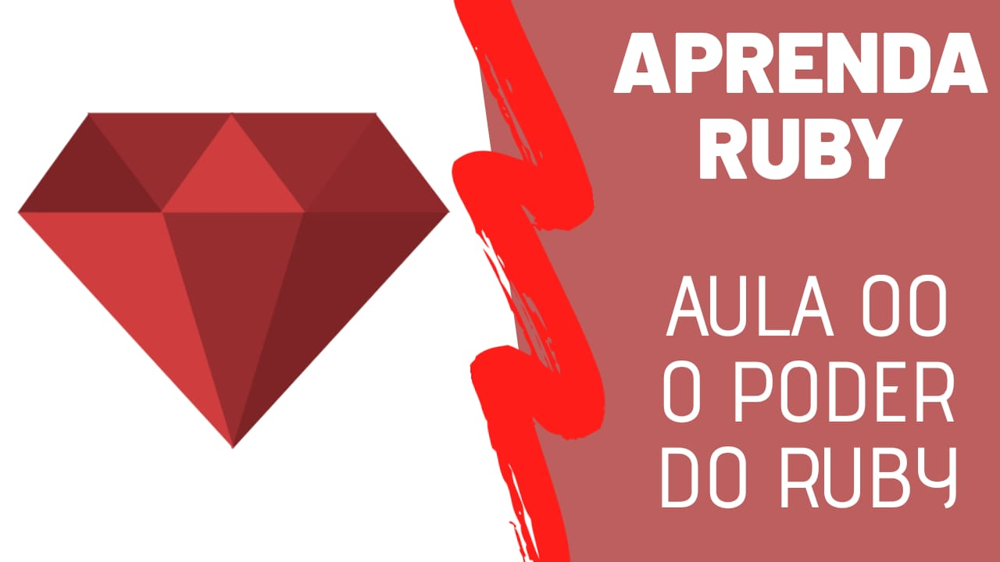

# Aprenda Ruby (2020 - Curso Para Iniciantes)

Código do curso que lecionei no canal [Noob Code](https://www.youtube.com/channel/UCE7utsNu7u7HqoZDT2OdUiA/playlists).

Se você deseja aprender Ruby e veio por outro meio que não foi o canal, então clique aqui -> [Aprenda Ruby](https://www.youtube.com/watch?v=bLDH3NypOVo&list=PLnV7i1DUV_zOit4a_tEDf1_PcRd25dL7e).

  

